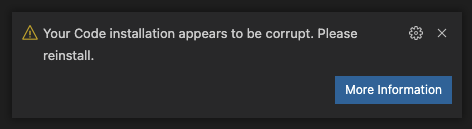
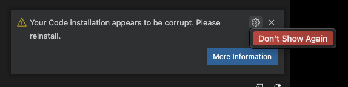
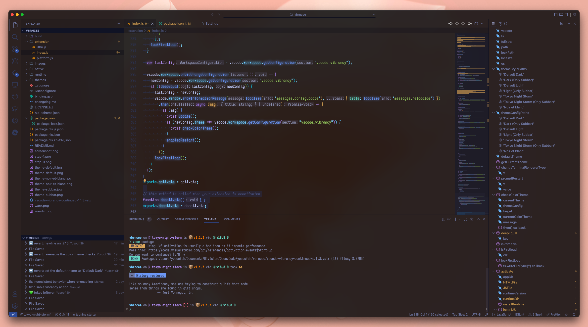

# Visual Studio Code Extension - Vibrancy Continued

> For questions about troubleshooting, installing or uninstalling Vibrancy Continued, please check the [FAQs](#FAQs).

> ❗️ Windows 10/11 users: **scroll down** to see an important warning regarding Windows support

Enable Acrylic/Glass effect in VS Code.


[](https://marketplace.visualstudio.com/items?itemName=illixion.vscode-vibrancy-continued)&nbsp;
[](https://marketplace.visualstudio.com/items?itemName=illixion.vscode-vibrancy-continued)&nbsp;
[](https://marketplace.visualstudio.com/items?itemName=illixion.vscode-vibrancy-continued)

[](https://github.com/illixion/vscode-vibrancy-continued)&nbsp;
[](https://github.com/illixion/vscode-vibrancy-continued)

Links: [GitHub](https://github.com/illixion/vscode-vibrancy-continued) | [Visual Studio Code Marketplace](https://marketplace.visualstudio.com/items?itemName=illixion.vscode-vibrancy-continued) | [issues](https://github.com/illixion/vscode-vibrancy-continued/issues)

Maintenance of this project is made possible by all the <a href="https://github.com/illixion/vscode-vibrancy-continued/graphs/contributors">contributors</a> and <a href="https://github.com/sponsors/illixion">sponsors</a>. If you'd like to sponsor this project and have your avatar or company logo appear below, <a href="https://github.com/sponsors/illixion">click here</a>. Any support is greatly appreciated 💖

<p align="center">
<a href="https://github.com/doughayden"></a>
<a href="https://github.com/hjnnjh"></a>
</p>

# ❗️ Important notice for Windows 10/11 users

### tl;dr YOU WON'T BE ABLE TO RESIZE THE VSCODE WINDOW unless you downgrade VSCode to 1.85.2

VSCode 1.86 and newer has known issues on Windows 10/11 due to breaking changes in Electron 27. Your VSCode windows **may stop being resizable, snappable or maximizable** if Vibrancy is applied on Windows, and you must also use "custom" for `window.titleBarStyle` setting. Some users have reported that [AltSnap](https://github.com/RamonUnch/AltSnap) may be able to solve this issue.

If this is undesired, **please downgrade to VSCode 1.85.2**, which can be downloaded using this URL: https://update.code.visualstudio.com/1.85.2/win32-x64-user/stable

For more information, see issues [#140](https://github.com/illixion/vscode-vibrancy-continued/issues/140) and [#122](https://github.com/illixion/vscode-vibrancy-continued/issues/122).

**For uninstallation instructions**, see FAQ: [How to uninstall Vibrancy](#how-to-uninstall-vibrancy)

# ⚠️ "Your VSCode installation appears to be corrupt"

This extension works by editing VS Code's checksum-verified HTML files, which means that a warning prompt will appear after installing and enabling Vibrancy Continued. This warning is safe to disregard, and all changes can be reverted. Click on the cogwheel and select **Don't Show Again** to hide it.




To fix the "[Unsupported]" warning on VS Code's title bar, please refer to this extension: [Fix VSCode Checksums](https://marketplace.visualstudio.com/items?itemName=lehni.vscode-fix-checksums).

# Supported Operating Systems

> **Warning**: Windows on ARM is currently unsupported ([issue](https://github.com/illixion/vscode-vibrancy-continued/issues/9))

✔ macOS

✔ Windows 11

✔ Windows 10

# Supported code editors

✔ Visual Studio Code

✔ VSCodium

✔ Cursor (see instructions [here](https://github.com/illixion/vscode-vibrancy-continued/issues/176#issuecomment-2503242180))

# Getting Started

1. Make sure the VSCode theme you've selected is 'Dark+' or one of the [supported themes](#vscode_vibrancytheme)


2. Install the extension from [Visual Studio Code Marketplace](https://marketplace.visualstudio.com/items?itemName=illixion.vscode-vibrancy-continued).

3. Press F1 and activate command "Reload Vibrancy."


4. Restart VSCode when prompted.

5. Update your VSCode configuration to include `"terminal.integrated.gpuAcceleration": "off"`

Each time VS Code is updated, please re-enable Vibrancy using the same steps. If you're experiencing issues, please check the [FAQs](#faqs).

## Options

#### vscode_vibrancy.type

Native method of Vibrancy Effect.

* auto : Automatically switch with system version.
* acrylic : (Windows 10 only) Fluent Design blur.
* under-window, fullscreen-ui, appearance-based, light, dark, titlebar, selection, menu, popover, sidebar, medium-light, ultra-dark: (MacOS only)

#### vscode_vibrancy.opacity

Opacity of Vibrancy Effect. -1 is theme default, 0 is maximum transparency, and 1 will remove all transparency.

*value: -1.0 ~ 1.0*

#### vscode_vibrancy.imports

Import any custom CSS/JS files into VSCode, as file paths. The files will be imported in the order they are listed. On Windows, forward slashes must be used.

EXAMPLE: `C:/Users/MyUserName/Documents/custom.css`

*value: array[]*

#### vscode_vibrancy.preventFlash

Use a new method for preventing window flashing during resizing. Eliminates the need for a refresh interval, but may be less compatible in some cases.

*boolean, default is true*

#### vscode_vibrancy.refreshInterval

Refresh interval (in milliseconds) for making the background transparent after window resizing. Lower values make the update less visible at the cost of increased CPU utilization. **Ignored when using "Prevent Flash" method.**

*value: 1 ~ 1000, default is 10*

#### vscode_vibrancy.enableAutoTheme

Enable automatic dark/light mode switching based on OS mode. Requires `window.autoDetectColorScheme` VSCode setting to also be enabled.

*boolean, default is false*

#### vscode_vibrancy.preferedDarkTheme / vscode_vibrancy.preferedLightTheme

Select which themes to use for light and dark modes, they will be used instead of the main Vibrancy theme selected.

#### vscode_vibrancy.theme

Select Vibrancy theme:

* Default Dark
* Dark (Only Subbar)
* Default Light
* Light (Only Subbar)
* Noir et blanc
* Tokyo Night Storm
* Tokyo Night Storm (Outer)
* Catppuccin Mocha
* Solarized Dark+
* GitHub Dark Default

| Theme | Screenshot |
| ---- | ---- |
| Default Dark |  |
| Dark (Only Subbar) |  |
| Noir et blanc |  |
| Tokyo Night Storm |  |
| Tokyo Night Storm (Only Subbar) |  |
| Solarized Dark+ (with theme: [Solarized](https://marketplace.visualstudio.com/items?itemName=ryanolsonx.solarized)) | 
| Catppuccin Mocha |  |
| GitHub Dark Default |  |

> You can contribute more themes! [see here](https://github.com/illixion/vscode-vibrancy-continued/tree/master/themes).

# FAQs

### How to uninstall Vibrancy?

Press F1 or ⌘+Shift+P and activate command **"Disable Vibrancy"**, then restart Visual Studio Code.

Just removing the extension without performing this step doesn't run the necessary cleanup code.

### Effect doesn't work correctly in VSCode terminal?

Check your settings. You should change the renderer type of the terminal to `dom`.

`"terminal.integrated.gpuAcceleration": "off"`

### Prompt "Run Visual Studio Code with administrator privileges"?

It usually appears on Windows when you are using the VSCode System Installer. You should close VSCode completely, then run VSCode as administrator and retry what you did before (Enable/Reload/Disable Vibrancy).

### `EACCES: permission denied` when enabling Vibrancy on macOS?

Your installation of VSCode is owned by another user. Run the following commands exactly as-is in the Terminal app to take ownership of the files, and enter your password when prompted:
```shell
sudo chown -R $(whoami):staff "/Applications/Visual Studio Code.app/"
sudo chmod -R 755 "/Applications/Visual Studio Code.app/"
```

A reinstallation will also fix this issue without any loss of settings.

### `EROFS: read-only file system` when enabling Vibrancy on macOS?

Your installation of VSCode is affected by [App Translocation](https://eclecticlight.co/2023/05/09/what-causes-app-translocation/). To fix this, either use the Finder and move VSCode to `/Applications` (or move it out of `/Applications` and then back in), or run the following terminal command:

```shell
sudo xattr -dr com.apple.quarantine "/Applications/Visual Studio Code.app"
```

### I'm on Windows 10 and I'm experiencing lag when dragging the window

[Please read here for details](https://github.com/EYHN/vscode-vibrancy/discussions/80).

### VSCode window cannot be resized/moved/maximized after enabling Vibrancy

Please see [Important notice for Windows users](#️-important-notice-for-windows-1011-users) at the top of the description.

### Effect doesn't work, but there are no errors

Ensure that you don't have transparency effects disabled globally through your OS settings. This can usually be found under Accessibility settings, and it may be called "Transparency effects" or "Reduce transparency." If that didn't help, you can also check the Console section in VSCode's Developer Tools, which can be accessed through the command palette.

If nothing else worked, try reinstalling VSCode, you won't lose any settings and this will ensure that your VSCode installation is consistent.

# Contributing

Contributions are what make the open source community such an amazing place to learn, inspire, and create. Vibrancy relies on user contributions, and as such, any contributions you make are **greatly appreciated**.

If you have a suggestion that would make this better, please fork the repo and create a pull request. You can also simply open an issue with the tag "enhancement".

Don't forget to give the project a star! Thanks again!

1. Fork the Project
2. Create your Feature Branch (`git checkout -b feature/AmazingFeature`)
3. Commit your Changes (`git commit -m 'Add some AmazingFeature'`)
4. Push to the Branch (`git push origin feature/AmazingFeature`)
5. Open a Pull Request

**When creating a PR**, please target the `development` branch.

# License

Distributed under the MIT License. See `LICENSE.txt` for more information.

## Thanks ⭐

[EYHN](https://github.com/EYHN) : for making the original Vibrancy that this is a fork of

[be5invis/vscode-custom-css](https://github.com/be5invis/vscode-custom-css) : The basis of this extension program

[DIYgod](https://github.com/microsoft/vscode/issues/32257#issuecomment-509936623) : Fix issues with VSCode 1.36
