# Visual Studio Code Extension - Vibrancy Continued

Enable Acrylic/Glass effect in VS Code.

> [!TIP]
> Solutions for common issues can be found in the [FAQ](#FAQs) and [Known Errors](https://github.com/illixion/vscode-vibrancy-continued/blob/main/docs/known-errors.md)

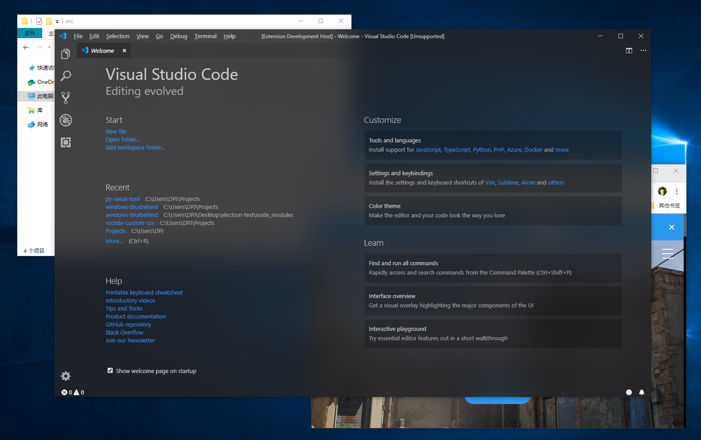

[](https://github.com/illixion/vscode-vibrancy-continued/actions/workflows/test.yml?query=event%3Aschedule)
[](https://marketplace.visualstudio.com/items?itemName=illixion.vscode-vibrancy-continued)&nbsp;
[](https://marketplace.visualstudio.com/items?itemName=illixion.vscode-vibrancy-continued)&nbsp;
[](https://marketplace.visualstudio.com/items?itemName=illixion.vscode-vibrancy-continued)&nbsp;
[](https://open-vsx.org/extension/illixion/vscode-vibrancy-continued)&nbsp;
[](https://open-vsx.org/extension/illixion/vscode-vibrancy-continued)

[](https://github.com/illixion/vscode-vibrancy-continued)&nbsp;
[](https://github.com/illixion/vscode-vibrancy-continued)

Links: [GitHub](https://github.com/illixion/vscode-vibrancy-continued) | [Visual Studio Code Marketplace](https://marketplace.visualstudio.com/items?itemName=illixion.vscode-vibrancy-continued) | [Open VSX Registry](https://open-vsx.org/extension/illixion/vscode-vibrancy-continued) | [issues](https://github.com/illixion/vscode-vibrancy-continued/issues)

Maintenance of this project is made possible by all the <a href="https://github.com/illixion/vscode-vibrancy-continued/graphs/contributors">contributors</a> and <a href="https://github.com/sponsors/illixion">sponsors</a>. If you'd like to sponsor this project and have your avatar or company logo appear below, <a href="https://github.com/sponsors/illixion">click here</a>. Any support is greatly appreciated 💖

<p align="center">
<a href="https://github.com/doughayden"></a>
<a href="https://github.com/hjnnjh"></a>
</p>

# 🪟 Windows 10/11 notes

**Vibrancy works out of the box on Windows — no extra setup is required.** By default the window is borderless **and opaque**, so Windows Aero Snap, maximize, and resize all keep working.

### Borderless look vs. window snapping (Windows 10)

On Windows there's one unavoidable trade-off, because a *transparent* window on Windows is a "layered" window that the OS **excludes from Aero Snap and maximize**:

- **Default (`windowMode: auto` / `frameless`)** — opaque window. **Snap, maximize, and resize work**, but Windows 10 draws a **thin 1px border** around the window (it disappears while you drag, and Windows 11 doesn't show it at all). This is a cosmetic limitation of opaque resizable windows on Win10 that can't be removed without breaking snapping.
- **Pixel-perfect (`windowMode: frameless-transparent`)** — fully transparent window. **No border at all**, the cleanest possible look — but **Aero Snap / maximize stop working**.

> [!TIP]
> Want the borderless look *and* snapping? Set `"vscode_vibrancy.windowMode": "frameless-transparent"` for the pixel-perfect window, and use a third-party window-snapping utility (e.g. [FancyZones](https://learn.microsoft.com/windows/powertoys/fancyzones) from PowerToys) to get snapping back. If you'd rather keep native snapping and don't mind the 1px Win10 border, just leave `windowMode` on `auto`.

### Windows 11 materials: Acrylic vs Mica

On Windows 11 you can choose the backdrop material via `vscode_vibrancy.type`:

- **`acrylic`** (default) — a real-time translucent blur of *whatever is behind the window*, including your other windows and the desktop. This is the classic see-through "glass" vibrancy effect.
- **`mica`** — samples only your *desktop wallpaper* (not the windows behind VSCode) and is mostly static, so it costs almost nothing on GPU/battery. It's Microsoft's recommended material for app backgrounds and gives a subtle, native Windows 11 feel rather than a see-through effect.
- **`tabbed`** — "Mica Alt", a more strongly tinted variant of Mica.

> [!TIP]
> On a laptop, or if you want the native Windows 11 look without the continuous-blur power cost of Acrylic, set `"vscode_vibrancy.type": "mica"` (or `"tabbed"`). Just note that Mica reflects your wallpaper only — it won't show the windows behind VSCode the way Acrylic does. Mica and Mica Alt are Windows 11 only; on Windows 10 they automatically fall back to Acrylic.

### Legacy / troubleshooting: window can't be resized, or text looks distorted

Some VSCode/Electron versions (and certain GPUs) had a hardware-acceleration bug where enabling Vibrancy made windows non-resizable/snappable/maximizable, or produced distorted, blurry text. **If you don't experience this, you can ignore this section.** If you do, apply the following mitigation:

1. Update your VSCode shortcut to include `--disable-gpu-compositing` at the end of the "Target" field, for example: `"C:\Users\User\AppData\Local\Programs\Microsoft VS Code\Code.exe" --disable-gpu-compositing`
2. (optional) Update your shell configuration to add the same argument to `code`, needed if VSCode isn't running when you use `code`
3. Install Vibrancy Continued
4. Go to settings and set **Window Mode** (`vscode_vibrancy.windowMode`) to `framed`
5. Press F1 and select **Reload Vibrancy**

For more information, see issues [#140](https://github.com/illixion/vscode-vibrancy-continued/issues/140) and [#122](https://github.com/illixion/vscode-vibrancy-continued/issues/122).

# ⚠️ "Your VSCode installation appears to be corrupt"

This extension works by editing VS Code's checksum-verified HTML files, which means that a warning prompt will appear after installing and enabling Vibrancy Continued. This warning is safe to disregard, and all changes can be reverted. Click on the cogwheel and select **Don't Show Again** to hide it.

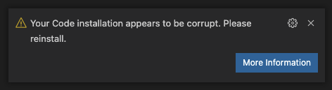
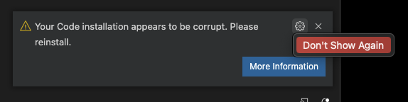

If you don't have the option to hide the alert, or to fix an `[Unsupported]` warning in VSCode's title bar, please refer to this extension: [Fix VSCode Checksums Next](https://marketplace.visualstudio.com/items?itemName=RimuruChan.vscode-fix-checksums-next).

# Supported Operating Systems

✔ macOS (Intel & Apple Silicon)

✔ Windows 10/11 (x64 & ARM64)

✔ Linux (transparency only, blur requires a compositor such as KWin, Hyprland, or Picom)

# Supported code editors

✔ Visual Studio Code (v1.86 and newer)

✔ VSCodium

✔ Code - OSS

✔ Cursor

✔ Antigravity

✔ Devin

Some editors may present a [persistent warning](#️-your-vscode-installation-appears-to-be-corrupt) warning about the installation being corrupted, use this extension to fix it: [Fix VSCode Checksums Next](https://marketplace.visualstudio.com/items?itemName=RimuruChan.vscode-fix-checksums-next).

# Getting Started

1. Install the extension from [Visual Studio Code Marketplace](https://marketplace.visualstudio.com/items?itemName=illixion.vscode-vibrancy-continued).

2. Press F1 and activate command "Reload Vibrancy."

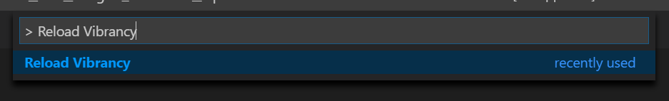

3. Restart VSCode when prompted.

Each time VS Code is updated, please re-enable Vibrancy using the same steps. If you're experiencing issues, please check the [FAQs](#faqs).

## Options

#### Type (`vscode_vibrancy.type`)

Native method of Vibrancy effect. See here for screenshots of all available options: [Vibrancy Types](https://github.com/illixion/vscode-vibrancy-continued/blob/main/docs/vibrancy-types.md)

* auto : Automatically switch with system version.
* transparent: Make VSCode transparent only, without blur. (Linux default)
* acrylic : Acrylic Fluent Design blur. (Windows)
* mica : Mica background material — tints with the desktop wallpaper. (Windows 11 only)
* tabbed : Mica Alt (Tabbed) background material — a stronger Mica variant. (Windows 11 only)
* under-window, fullscreen-ui, appearance-based, light, dark, titlebar, selection, menu, popover, sidebar, medium-light, ultra-dark: (MacOS only)

> On Windows 10, `mica` and `tabbed` aren't available and fall back to `acrylic`. The Mica/Tabbed materials use the modern DWM backdrop API, which only exists on Windows 11.

#### Opacity (`vscode_vibrancy.opacity`)

Opacity of Vibrancy effect. -1 is theme default, 0 is maximum transparency, and 1 will remove all transparency.

*value: -1.0 ~ 1.0*

#### Background Override (`vscode_vibrancy.backgroundOverride`)

Override the theme's background color for the vibrancy opacity effect. Uses VSCode's built-in color picker. Leave empty to use the theme default.

*color string (e.g. #000000), default is empty*

#### Custom imports (`vscode_vibrancy.imports`)

Import any custom CSS/JS files into the VSCode editor directly without requiring custom CSS extensions. The files will be imported in the order they are listed. On Windows, forward slashes must be used.

Use this feature to add a custom Vibrancy Continued theme or modify an existing one.

EXAMPLES:

- Windows: `[ C:/Users/MyUserName/Documents/custom.css ]`
- macOS: `[ /Users/MyUserName/Documents/custom.css ]`
- Linux: `[ /home/MyUserName/Documents/custom.css ]`

*value: array[]*

#### Prevent Flash (`vscode_vibrancy.preventFlash`)

Use a new method for preventing window flashing during resizing. Eliminates the need for a refresh interval, but may be less compatible in some cases.

*boolean, default is true*

#### Window Mode (`vscode_vibrancy.windowMode`)

Controls how the VSCode window frame and transparency are applied. **Leave this on `auto` unless you're troubleshooting a rendering issue** — `auto` already picks the right combination for your platform.

*enum, default is `auto`*

| Value | Frame | Window | Notes |
| --- | --- | --- | --- |
| `auto` | platform default | platform default | Recommended. macOS → borderless + opaque; Windows → borderless + opaque (Aero Snap works; thin border on Win10); Linux → borderless + transparent. |
| `framed` | OS title bar/frame | opaque | Most compatible. Use if a borderless window misbehaves for you. |
| `frameless` | borderless | opaque | Keeps Windows Aero Snap / maximize / resize, at the cost of a thin window border on Windows 10 (Windows 11 has none). On macOS this is the default and fixes the file-browser hover flash **without** the GPU cost of a transparent window ([#207](https://github.com/illixion/vscode-vibrancy-continued/issues/207)). |
| `frameless-transparent` | borderless | transparent | Fully borderless, but **Windows Aero Snap / maximize won't work** (see the Windows note below). Also required for the `transparent` vibrancy type. On macOS Tahoe a transparent window raises WindowServer GPU/power usage. |

> The window's *transparency* is not the same as the vibrancy effect: vibrancy shows fine on an **opaque** window (macOS via the native effect view, Windows via the DWM material / accent on the window). A see-through (transparent) window is only required for the `transparent` vibrancy type — and on Windows a transparent window is a *layered* window, which the OS excludes from Aero Snap.

> **Deprecated settings:** `vscode_vibrancy.forceFramelessWindow` and `vscode_vibrancy.disableFramelessWindow` are replaced by `windowMode`. If still set (and `windowMode` is left at `auto`) they are migrated automatically: `disableFramelessWindow` → `framed`, and `forceFramelessWindow` → the frameless mode appropriate for your platform — `frameless` (opaque) on macOS and with Windows 11 Mica/Acrylic materials, `frameless-transparent` where a see-through window is actually needed. You don't need to do anything, but you can switch to `windowMode` directly to silence the deprecation warning.

#### Disable Theme Fixes (`vscode_vibrancy.disableThemeFixes`)

Disable fixes to Default Dark and Default Light themes for non-VSCode editors like Cursor.

#### Disable Color Customizations (`vscode_vibrancy.disableColorCustomizations`)

Prevent Vibrancy from modifying `workbench.colorCustomizations` which is used to make some elements like the terminal vibrant. Enable this if you want to manage color customizations yourself, or if you use a custom CSS theme that handles its own background colors and transparency. When enabled mid-session, any previously written vibrancy colors will be restored to their original values.

*boolean, default is false*

#### Refresh interval (`vscode_vibrancy.refreshInterval`)

Refresh interval (in milliseconds) for making the background transparent after window resizing. Lower values make the update less visible at the cost of increased CPU utilization. **Ignored when using "Prevent Flash" method.**

*value: 1 ~ 1000, default is 10*

#### Automatic theme switching (`vscode_vibrancy.enableAutoTheme`)

Enable automatic dark/light mode switching based on OS mode. Requires `window.autoDetectColorScheme` VSCode setting to also be enabled.

*boolean, default is false*

#### Preferred dark/light theme (`vscode_vibrancy.preferredDarkTheme / vscode_vibrancy.preferredLightTheme`)

Select which themes to use for light and dark modes, they will be used instead of the main Vibrancy Continued theme selected.

> The previous misspelled keys `vscode_vibrancy.preferedDarkTheme` / `vscode_vibrancy.preferedLightTheme` are deprecated but still honored — if you have them set, your value is used automatically. Move it to the corrected key to silence the deprecation warning.

#### theme (`vscode_vibrancy.theme`)

Select Vibrancy theme:

* Default Dark
* Dark (Only Subbar)
* Default Light
* Light (Only Subbar)
* Noir et blanc
* Tokyo Night Storm
* Tokyo Night Storm (Outer)
* Catppuccin Mocha
* Solarized Dark+
* GitHub Dark Default

| Theme | Screenshot |
| ---- | ---- |
| Default Dark | 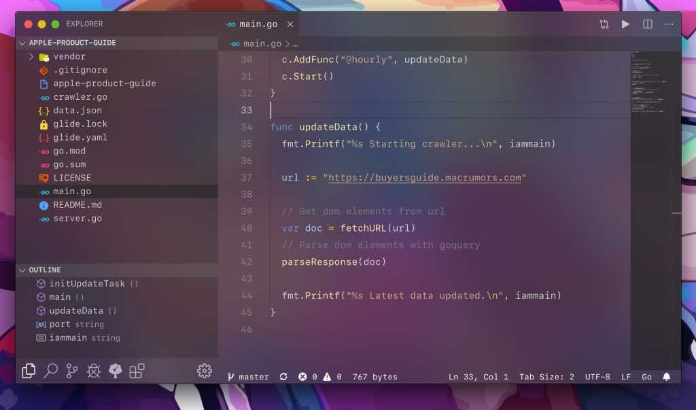 |
| Dark (Only Subbar) | 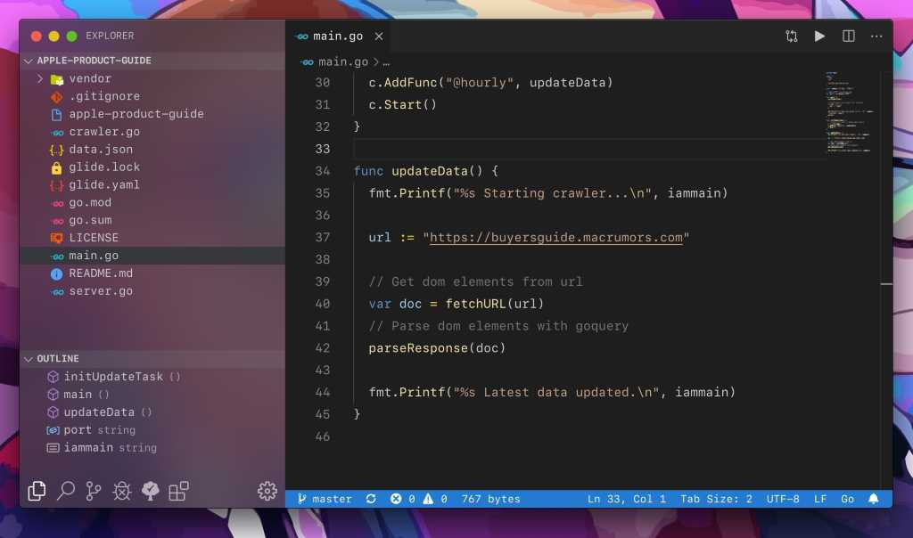 |
| Noir et blanc | 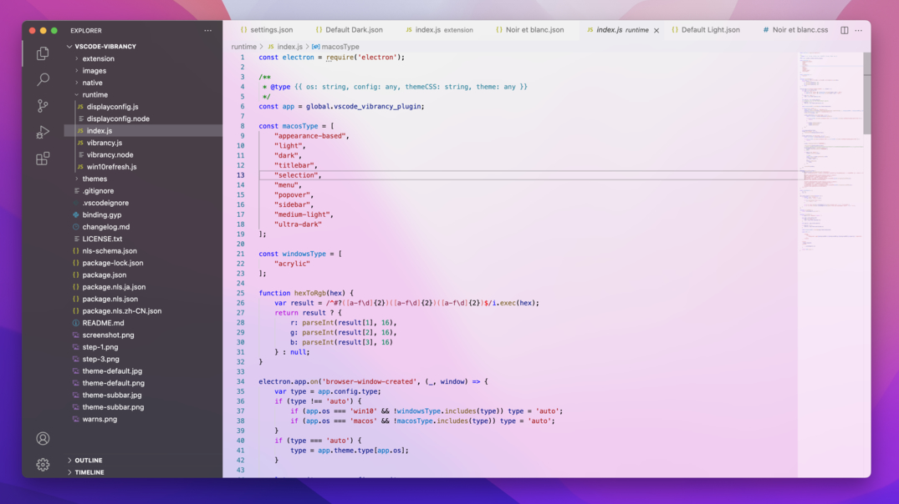 |
| Tokyo Night Storm | 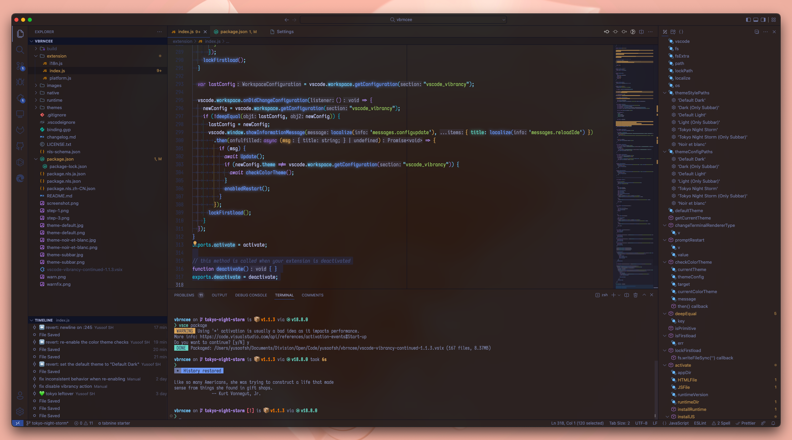 |
| Tokyo Night Storm (Only Subbar) | 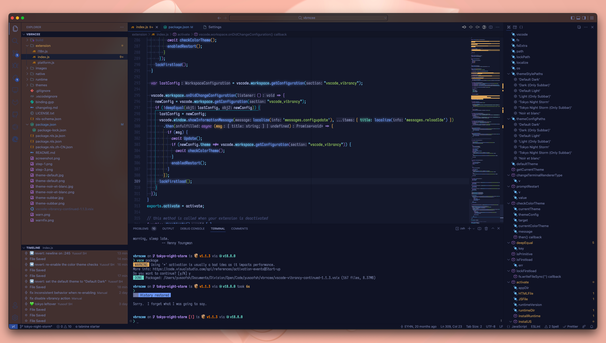 |
| Solarized Dark+ (with theme: [Solarized](https://marketplace.visualstudio.com/items?itemName=ryanolsonx.solarized)) | 
| Catppuccin Mocha | 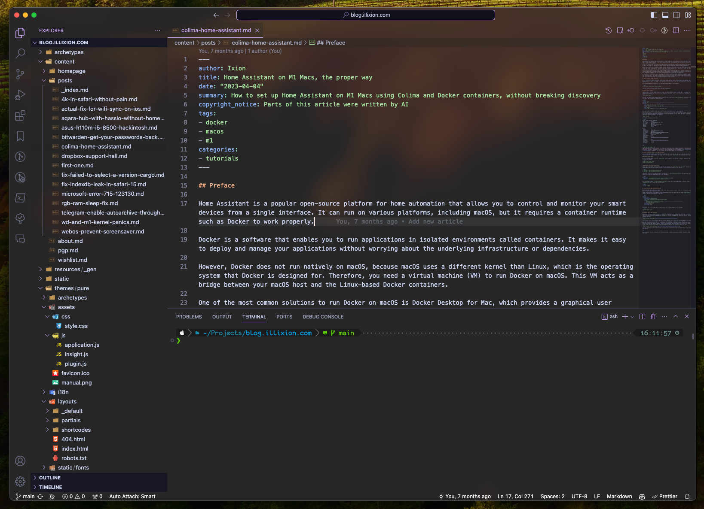 |
| GitHub Dark Default | 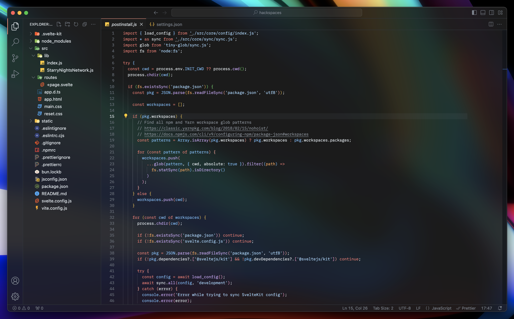 |
| [Paradise](https://marketplace.visualstudio.com/items?itemName=nickesc.vscode-paradise-nickesc) Smoked Glass |  |
| [Paradise](https://marketplace.visualstudio.com/items?itemName=nickesc.vscode-paradise-nickesc) Frosted Glass |  |

> You can contribute more themes! [see here](https://github.com/illixion/vscode-vibrancy-continued/tree/master/themes).

# FAQs

### How to uninstall Vibrancy?

Press F1 or ⌘+Shift+P and activate command **"Disable Vibrancy"**, then restart Visual Studio Code.

You can also just uninstall the extension and restart VSCode, which will automatically remove Vibrancy.

### Effect doesn't work correctly in VSCode terminal?

Check your settings. You should change the renderer type of the terminal to `dom`.

`"terminal.integrated.gpuAcceleration": "off"`

### `EROFS: read-only file system` when enabling Vibrancy on macOS?

Your installation of VSCode is affected by [App Translocation](https://developer.apple.com/forums/thread/724969).

To fix this, either use the Finder and move VSCode to `/Applications` (or move it out of `/Applications` and then back in), or run the following terminal command:

```shell
sudo xattr -dr com.apple.quarantine "/Applications/Visual Studio Code.app"
```

### I'm on Windows 10 and I'm experiencing lag when dragging the window

[Please read here for details](https://github.com/EYHN/vscode-vibrancy/discussions/80).

### VSCode window cannot be resized/moved/maximized after enabling Vibrancy

Please see [Important notice for Windows users](#️-important-notice-for-windows-1011-users) at the top of the description.

### Effect doesn't work, but there are no errors

Ensure that you don't have transparency effects disabled globally through your OS settings.

This can usually be found under Accessibility settings, and it may be called "Transparency effects" or "Reduce transparency." If that didn't help, you can also check the Console section in VSCode's Developer Tools, which can be accessed through the command palette.

If nothing else worked, try reinstalling VSCode, you won't lose any settings and this will ensure that your VSCode installation is consistent.

### Linux: Why is the background transparent but not blurred?

Currently, we do not support native blur effects on Linux. While transparency can work on its own, blur usually depends on additional support from the system compositor. To achieve a blur effect, use transparent mode together with a compositor such as KWin, Hyprland, or Picom.

# Contributing

Contributions are what make the open source community such an amazing place to learn, inspire, and create. Vibrancy relies on user contributions, and as such, any contributions you make are **greatly appreciated**.

If you have a suggestion that would make this better, please fork the repo and create a pull request. You can also simply open an issue with the tag "enhancement".

Don't forget to give the project a star! Thanks again!

1. Fork the Project
2. Create your Feature Branch (`git checkout -b feature/AmazingFeature`)
3. Commit your Changes (`git commit -m 'Add some AmazingFeature'`)
4. Push to the Branch (`git push origin feature/AmazingFeature`)
5. Open a Pull Request

**When creating a PR**, please target the `development` branch.

# License

Distributed under the MIT License. See `LICENSE.txt` for more information.

## Thanks ⭐

[EYHN](https://github.com/EYHN) : for making the original Vibrancy that this is a fork of

[be5invis/vscode-custom-css](https://github.com/be5invis/vscode-custom-css) : The basis of this extension program

[DIYgod](https://github.com/microsoft/vscode/issues/32257#issuecomment-509936623) : Fix issues with VSCode 1.36
