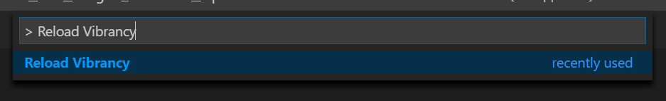

# Visual Studio Code Extension - Vibrancy Continued

> For questions about troubleshooting, installing or uninstalling Vibrancy Continued, please check the [FAQs](#FAQs).

Enable Acrylic/Glass effect in VS Code.


[](https://marketplace.visualstudio.com/items?itemName=illixion.vscode-vibrancy-continued)&nbsp;
[](https://marketplace.visualstudio.com/items?itemName=illixion.vscode-vibrancy-continued)&nbsp;
[](https://marketplace.visualstudio.com/items?itemName=illixion.vscode-vibrancy-continued)


[](https://github.com/illixion/vscode-vibrancy-continued)&nbsp;
[](https://github.com/illixion/vscode-vibrancy-continued)

Links: [GitHub](https://github.com/illixion/vscode-vibrancy-continued) | [Visual Studio Code Marketplace](https://marketplace.visualstudio.com/items?itemName=illixion.vscode-vibrancy-continued) | [issues](https://github.com/illixion/vscode-vibrancy-continued/issues)

[中文教程 (Chinese README)](https://eyhn.in/vscode-vibrancy/)

# Important notice for Windows users

VSCode 1.86.x is incompatible on Windows 10/11 due to Electron 27 introducing breaking changes to how transparent windows are handled. If you wish to use Vibrancy, please downgrade to VSCode 1.85.2, which can be downloaded using this URL: https://update.code.visualstudio.com/1.85.2/win32-x64-user/stable

For more information, see issue [#122](https://github.com/illixion/vscode-vibrancy-continued/issues/122).

# "Your VSCode installation appears to be corrupt"

This extension works by editing VS Code's checksum-verified HTML file, which means that a warning prompt will appear after installing and enabling Vibrancy Continued. This warning is safe to disregard, and all changes can be reverted. Click on the cogwheel and select **Don't Show Again** to hide it.


To fix the "[Unsupported]" warning on VS Code's title bar, please refer to this extension: [Fix VSCode Checksums](https://marketplace.visualstudio.com/items?itemName=lehni.vscode-fix-checksums).

# Supported Operating Systems

> **Warning**: Windows on ARM is currently unsupported, see #9 for more details

✔ Windows 11 (up to 1.85.x)

✔ Windows 10 (up to 1.85.x)

✔ macOS

# Getting Started

1. Make sure the VSCode theme you've selected is 'Dark+' or one of the [supported themes](#vscode_vibrancy.theme)


2. Install the extension from [Visual Studio Code Marketplace](https://marketplace.visualstudio.com/items?itemName=illixion.vscode-vibrancy-continued).

3. Press F1 and activate command "Reload Vibrancy."



4. Restart VSCode when prompted.

Each time VS Code is updated, please re-enable Vibrancy using the same steps.

## Options

#### vscode_vibrancy.type

Native method of Vibrancy Effect.

* auto : Automatically switch with system version.
* acrylic : (Windows 10 only) Fluent Design blur.
* under-window, fullscreen-ui, appearance-based, light, dark, titlebar, selection, menu, popover, sidebar, medium-light, ultra-dark: (MacOS only)
  * Note that many of these types will be deprecated in VSC 1.86

#### vscode_vibrancy.opacity

Opacity of Vibrancy Effect. -1 is theme default, 0 is maximum transparency, and 1 will remove all transparency.

*value: -1.0 ~ 1.0*

#### vscode_vibrancy.imports

Import custom CSS/JS files into VSCode, as file paths. The files will be imported in the order they are listed.

EXAMPLE: `C:/Users/MyUserName/Documents/custom.css`

*value: array[]*

#### vscode_vibrancy.preventFlash

Use a new method for preventing window flashing during resizing. Eliminates the need for a refresh interval, but may be less compatible in some cases.

*boolean, default is true*

#### vscode_vibrancy.refreshInterval

Refresh interval (in milliseconds) for making the background transparent after window resizing. Lower values make the update less visible at the cost of increased CPU utilization. **Ignored when using "Prevent Flash" method.**

*value: 1 ~ 1000, default is 10*

#### vscode_vibrancy.theme

Select Vibrancy theme:

* Default Dark
* Dark (Only Subbar)
* Default Light
* Light (Only Subbar)
* Noir et blanc
* Tokyo Night Storm
* Tokyo Night Storm (Outer)
* Solarized Dark+

| Theme | Screenshot |
| ---- | ---- |
| Default Dark |  |
| Dark (Only Subbar) |  |
| Noir et blanc |  |
| Tokyo Night Storm |  |
| Tokyo Night Storm (Only Subbar) |  |
| Solarized Dark+ (with theme: [Solarized](https://marketplace.visualstudio.com/items?itemName=ryanolsonx.solarized)) | 
| Catpuccin Mocha |  |
| GitHub Dark Default |  |

> You can contribute more themes! [see here](https://github.com/illixion/vscode-vibrancy-continued/tree/master/themes).

# FAQs

### How to uninstall Vibrancy?

Press F1 or ⌘+Shift+P and activate command "Disable Vibrancy", then restart Visual Studio Code.

### Effect doesn't work for terminal?

Check your settings. You should change the renderer type of the terminal to dom.

`"terminal.integrated.gpuAcceleration": "off"`

### Prompt "Run Visual Studio Code with administrator privileges"?

It usually appears on Windows when you are using the VSCode System Installer. You should close VSCode completely, then run VSCode as administrator and retry what you did before (Enable/Reload/Disable Vibrancy).

### `EROFS: read-only file system` when enabling Vibrancy on macOS

Your installation of VSCode is affected by App Translocation. To fix this, either use the Finder and move VSCode to `/Applications` (or move it out of `/Applications` and then back in), or run the following terminal command:

```shell
sudo xattr -dr com.apple.quarantine "/Applications/Visual Studio Code.app"
```

### I'm on Windows 10 and I'm experiencing lag when dragging the window

[Please read here for details](https://github.com/EYHN/vscode-vibrancy/discussions/80).

### Effect doesn't work, but there aren't any errors

Ensure that you don't have transparency effects disabled globally through your OS settings. This can usually be found under Accessibility settings, and it may be called "Transparency effects" or "Reduce transparency." If that didn't help, you can also check the Console section in VSCode's Developer Tools, which can be accessed through the command palette.

If nothing else worked, try reinstalling VSCode, you won't lose any settings and this will ensure that your VSCode installation is consistent.

### Window is opaque and text is blurry while scrolling

Please see [Important notice for Windows users](#important-notice-for-windows-users) at the top of the description.

# Contributing

Contributions are what make the open source community such an amazing place to learn, inspire, and create. Any contributions you make are **greatly appreciated**.

If you have a suggestion that would make this better, please fork the repo and create a pull request. You can also simply open an issue with the tag "enhancement".
Don't forget to give the project a star! Thanks again!

1. Fork the Project
2. Create your Feature Branch (`git checkout -b feature/AmazingFeature`)
3. Commit your Changes (`git commit -m 'Add some AmazingFeature'`)
4. Push to the Branch (`git push origin feature/AmazingFeature`)
5. Open a Pull Request

# License

Distributed under the MIT License. See `LICENSE.txt` for more information.

## Thanks ⭐

[EYHN](https://github.com/EYHN) : for making the original Vibrancy that this is a fork of

[be5invis/vscode-custom-css](https://github.com/be5invis/vscode-custom-css) : The basis of this extension program

[DIYgod](https://github.com/microsoft/vscode/issues/32257#issuecomment-509936623) : Fix issues with VSCode 1.36
