# Vibrancy Continued Types - Visual Reference

This page showcases how the different `vscode_vibrancy.type` settings will look as of macOS Sequoia 15.5 and Windows 11 24H2. Note that their visual appearance is tied to the current OS and Electron versions, and are subject to change. Acrylic type is only available on Windows, and all other styles are only available on macOS.

All screenshots use an opacity value of 0, whereas the default value in most themes is 0.4, you can increase this value to darken the background.

---

| Type | Image |
|---|---|
| Auto | 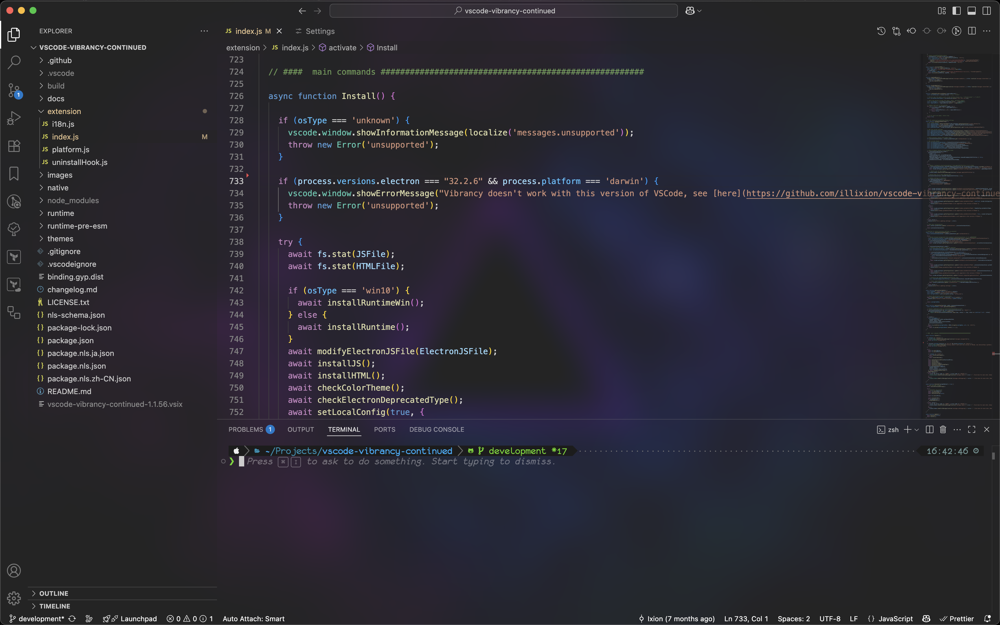 |
| Acrylic |  |
| Under-Window | 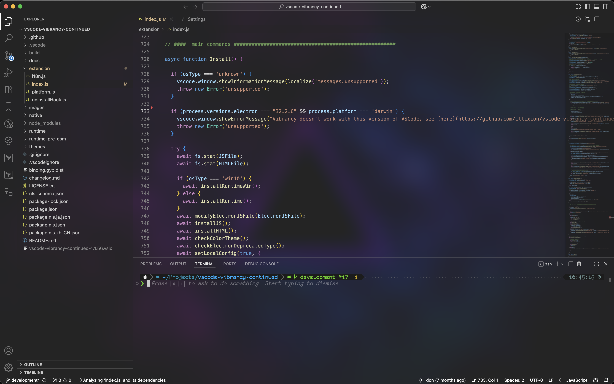 |
| Fullscreen-UI | 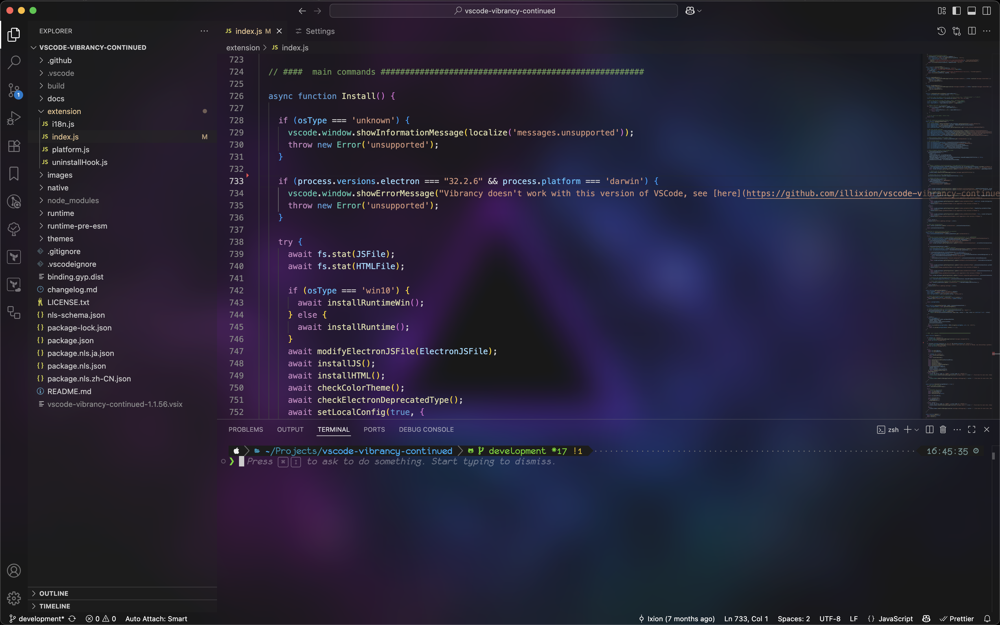 |
| Titlebar | 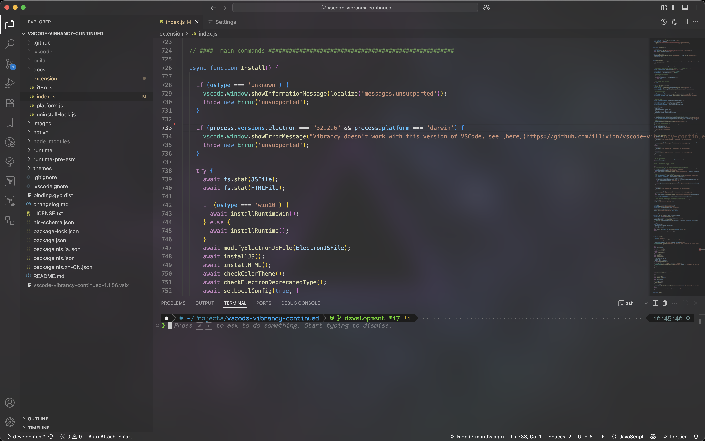 |
| Selection | 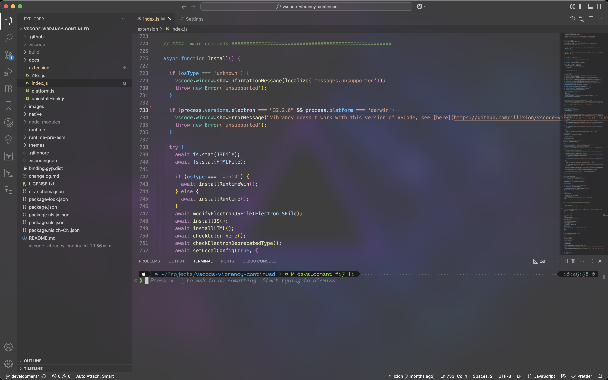 |
| Menu | 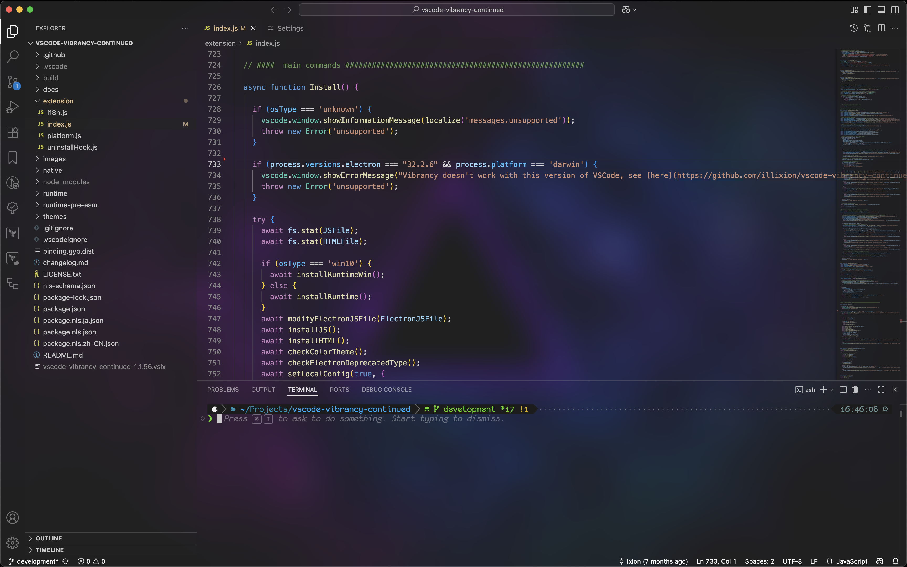 |
| Popover | 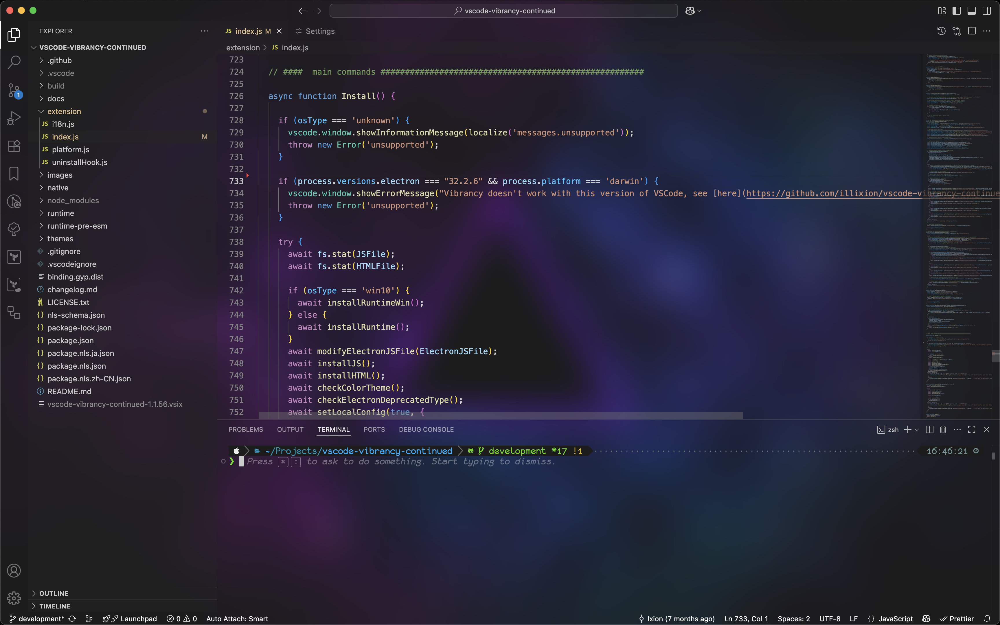 |
| Sidebar | 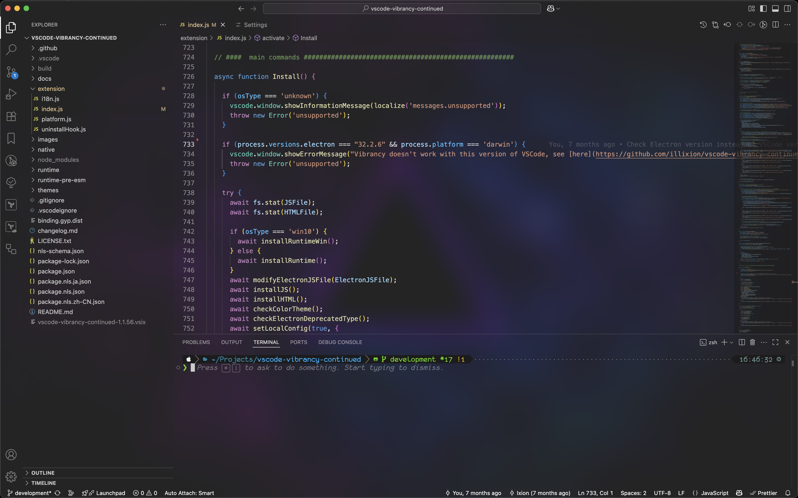 |
| Header | 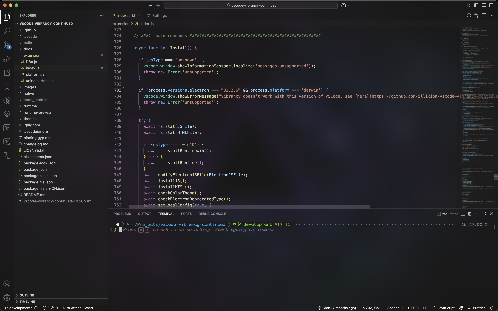 |
| HUD | 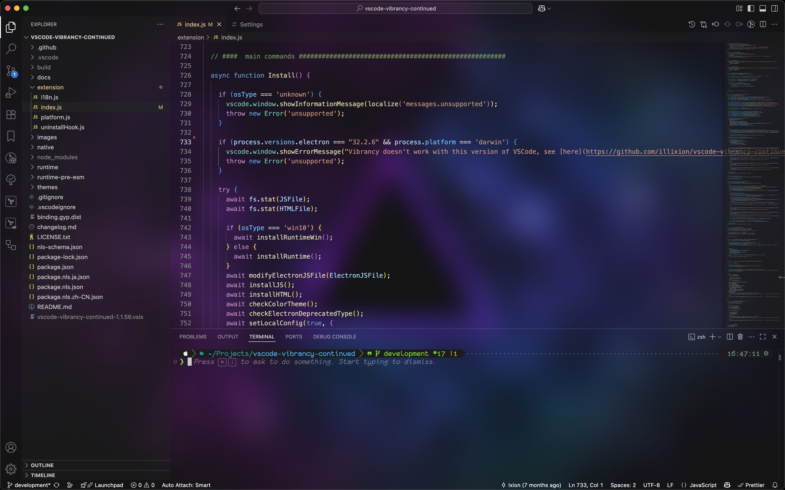 |
| Tooltip | 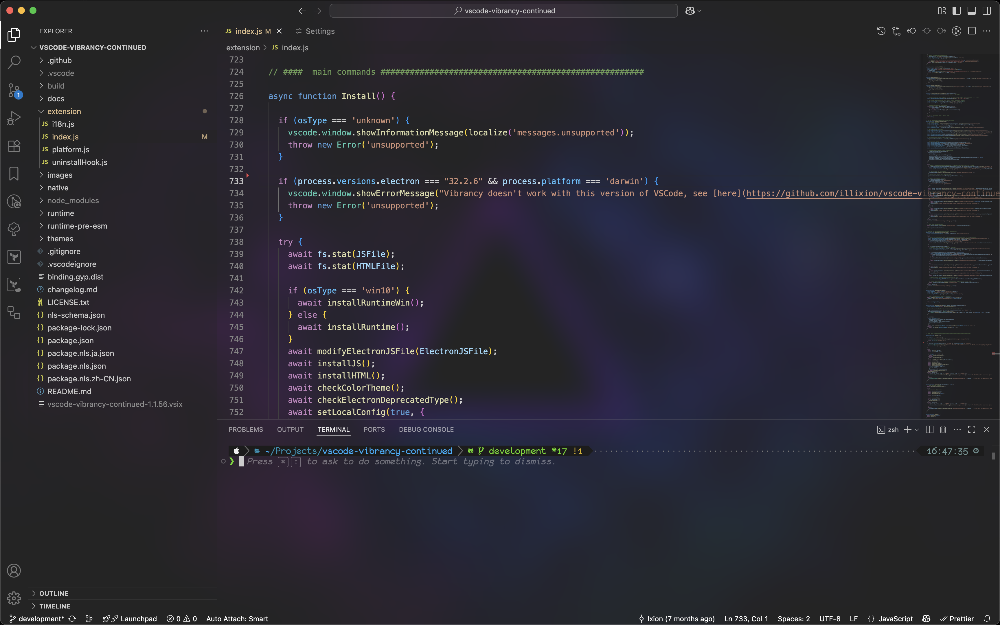 |

# Deprecated types

The following types have been deprecated in latest macOS and result in no transparency:

- Content
- Sheet
- Under-Page
- Window
- Appearance-Based
- Dark
- Ultra-Dark
- Light
- Medium-Light

See Electron BrowserWindow documentation for more info: https://www.electronjs.org/docs/latest/api/browser-window#winsetvibrancytype-options-macos
