# Vibrancy Continued Types - Visual Reference

This page showcases how the different `vscode_vibrancy.type` settings will look as of macOS Sequoia 15.5 and Windows 11 24H2. Note that their visual appearance is tied to the current OS and Electron versions, and are subject to change. Acrylic type is only available on Windows, and all other styles are only available on macOS.

All screenshots use an opacity value of 0, whereas the default value in most themes is 0.4, you can increase this value to darken the background.

---

| Type | Image |
|---|---|
| Auto | 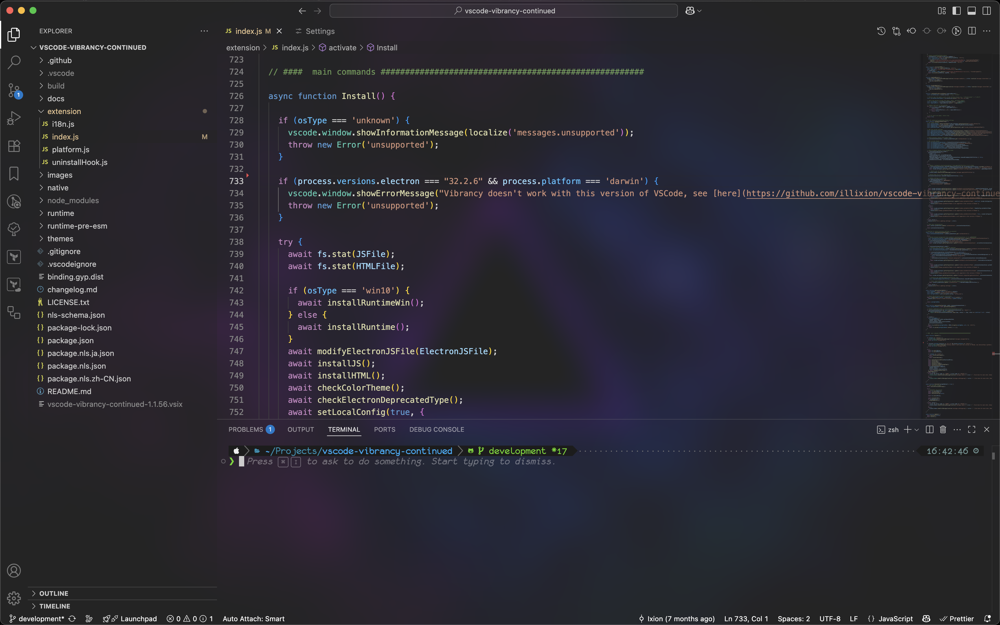 |
| Acrylic |  |
| Under-Window | 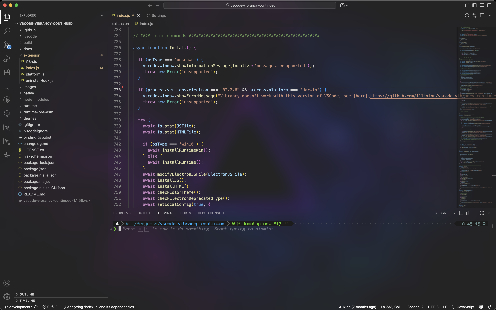 |
| Fullscreen-UI | 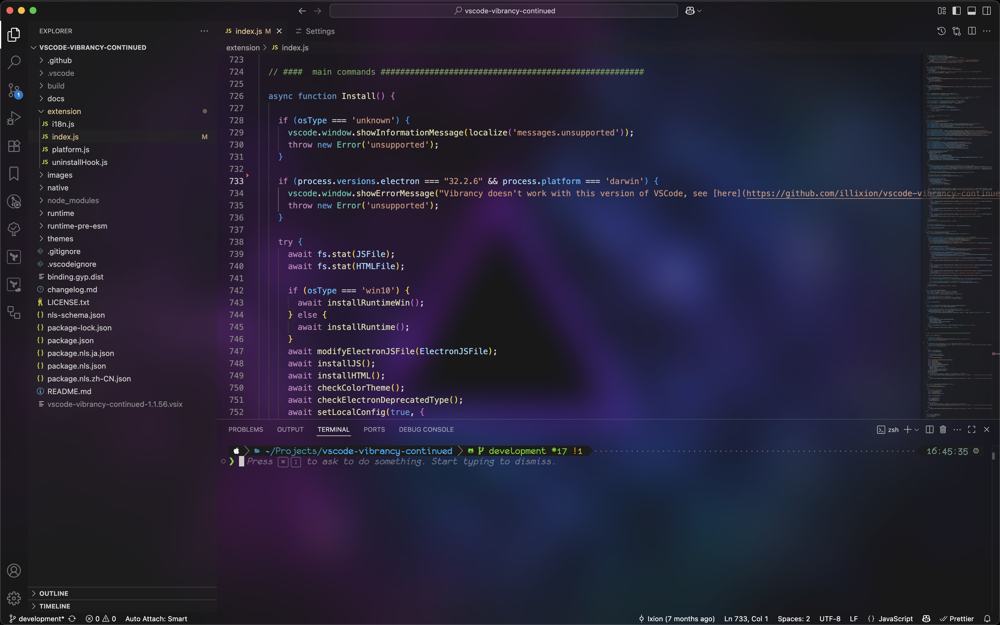 |
| Titlebar | 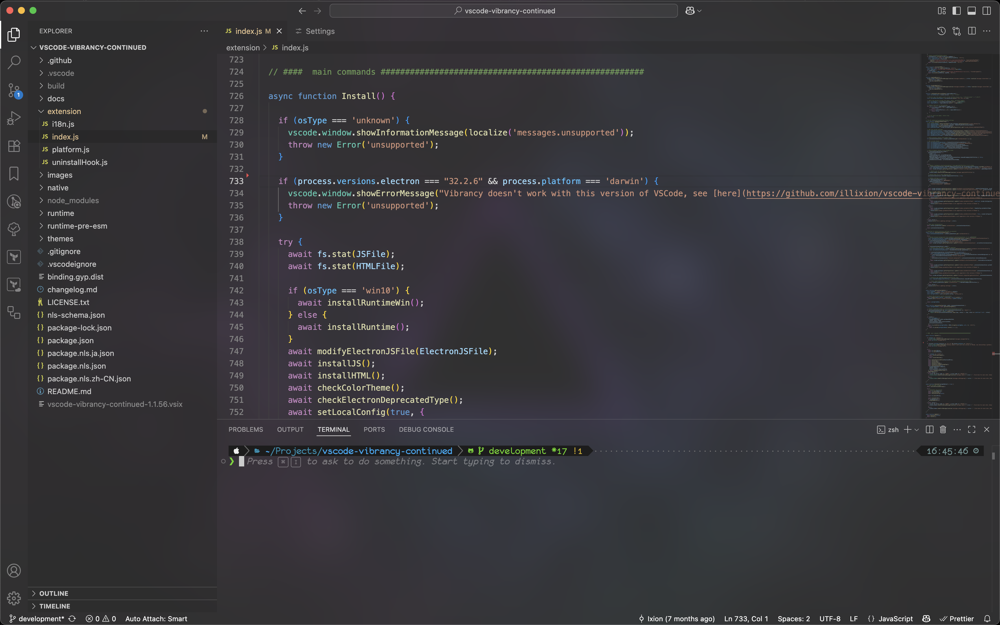 |
| Selection | 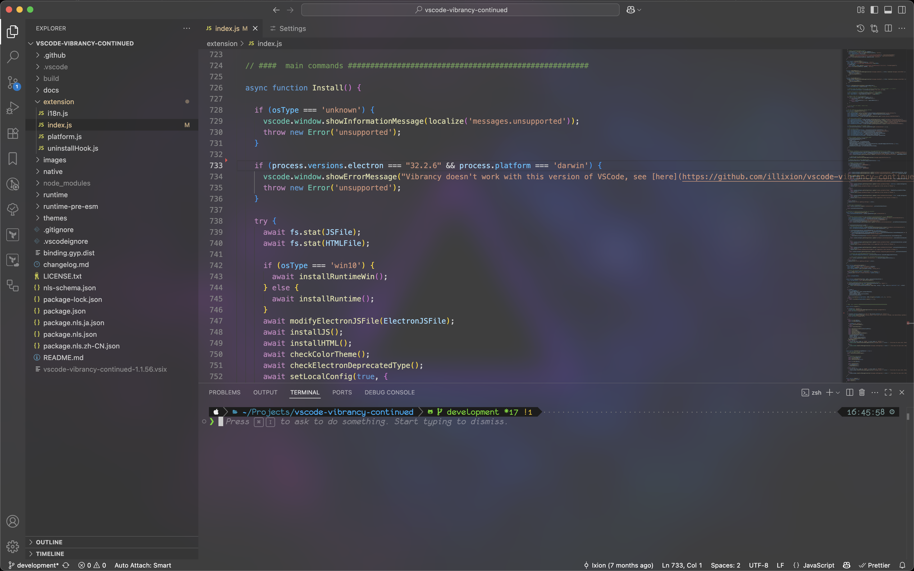 |
| Menu | 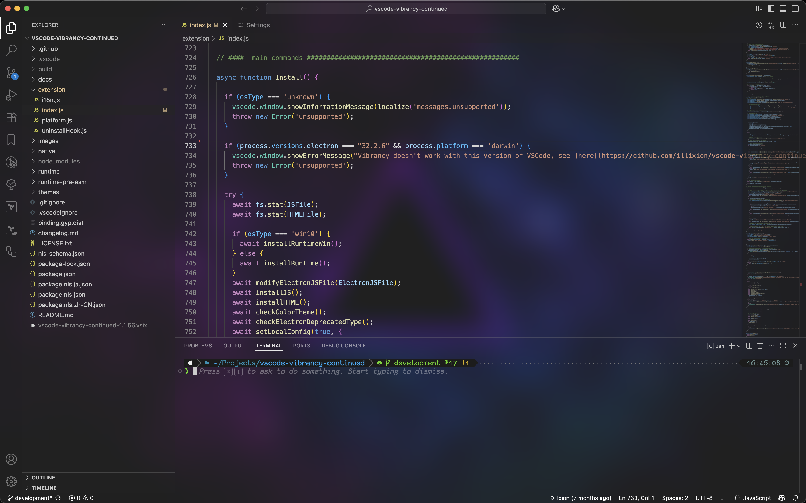 |
| Popover | 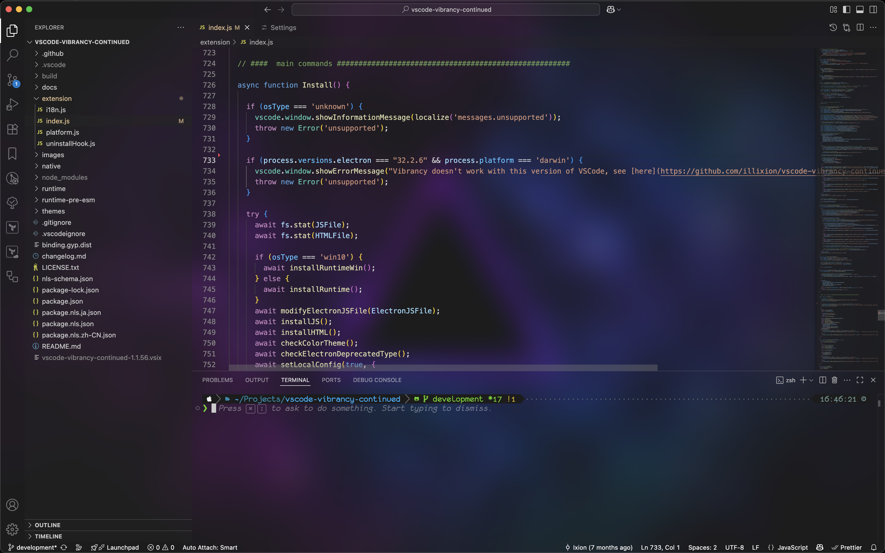 |
| Sidebar | 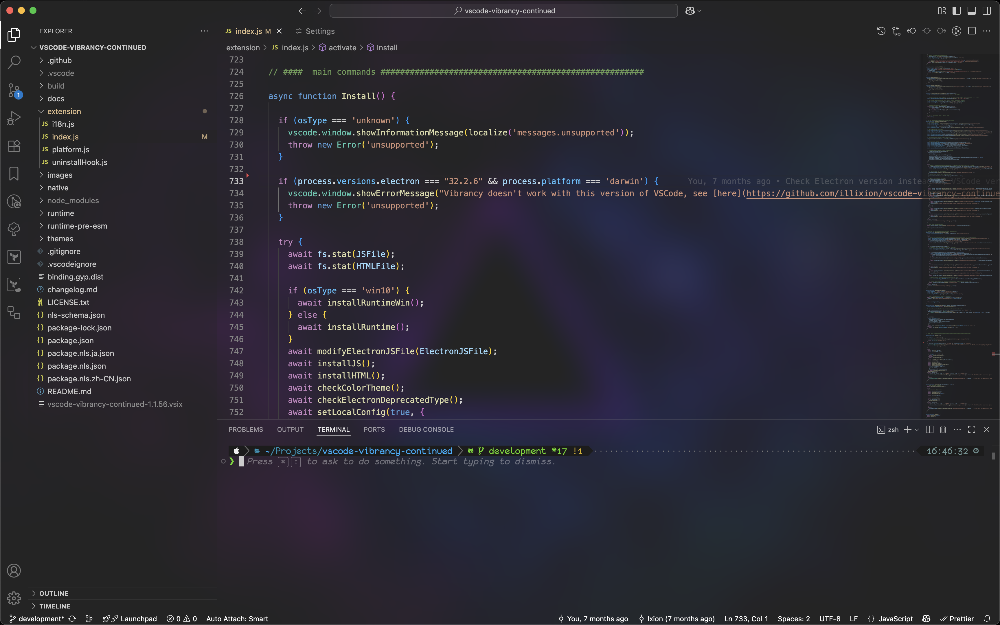 |
| Header | 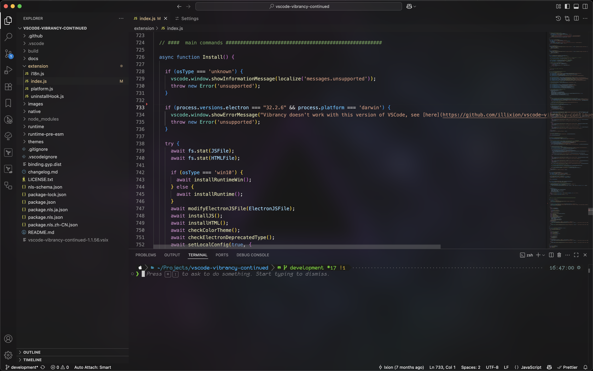 |
| HUD | 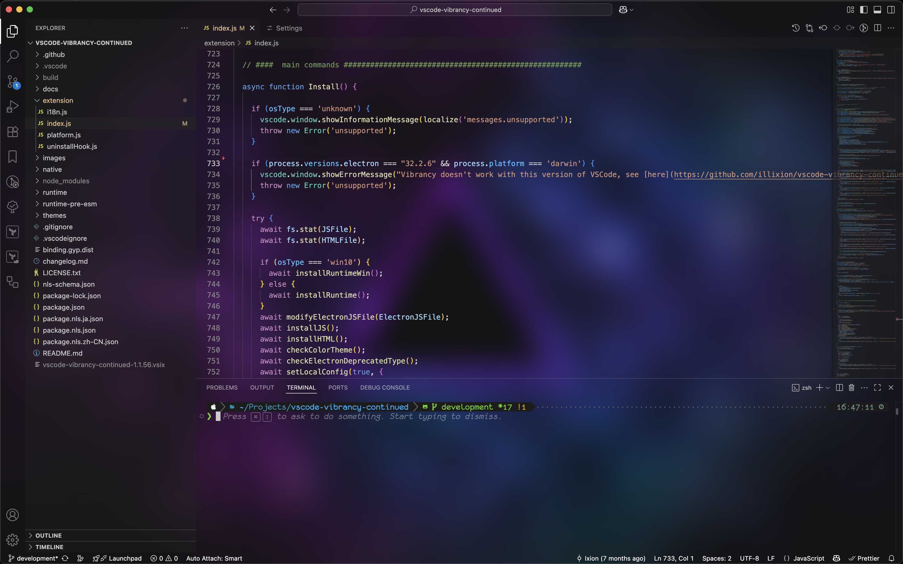 |
| Tooltip | 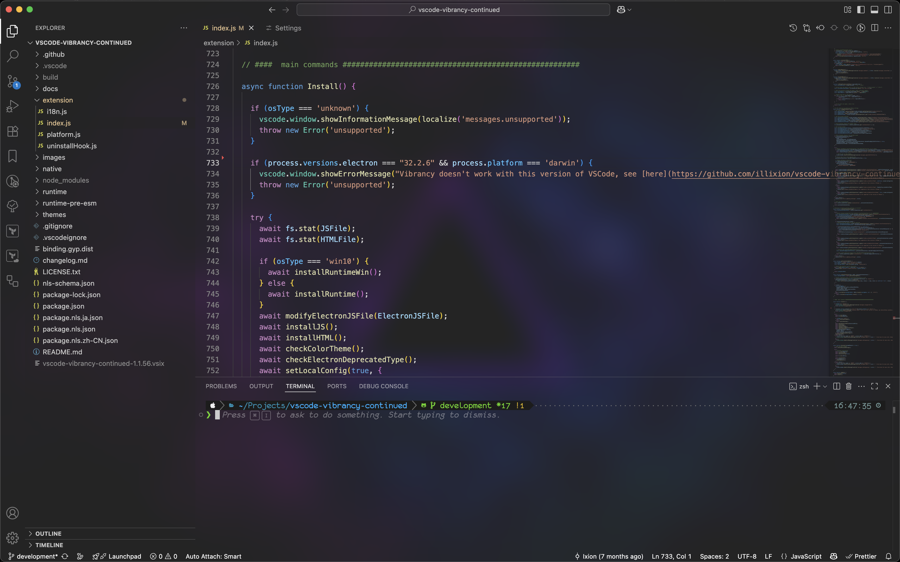 |

# Wallpaper tinting in full screen (macOS)

In native macOS full screen there is no desktop behind the window, so instead of transparency the system applies **wallpaper tinting**: it blends your wallpaper's average color into the vibrancy material. This requires **System Settings → Appearance → "Allow wallpaper tinting in windows"** (on by default); the setting is read at app launch, so restart VSCode after toggling it.

How much tint each material receives varies a lot. Measured per type on macOS 26 in dark mode:

| Tint strength | Types |
|---|---|
| Strong | `hud`, `fullscreen-ui`, `menu`, `popover` |
| Moderate | `under-window`, `sidebar`, `tooltip`, `selection` |
| Subtle | `titlebar`, `header` |
| Barely visible | `window`, `content`, `sheet`, `under-page` |

`auto` resolves to `under-window` on macOS for every bundled theme (Tokyo Night Storm (Outer) uses `fullscreen-ui`), so default configurations show a clearly visible tint. If full screen looks flat grey despite tinting being enabled, check whether you've explicitly set one of the barely-visible types.

The deprecated types below also tint when used — they appear to map onto modern materials internally (`appearance-based` renders identically to `under-window`) — but they remain deprecated either way.

# Deprecated types

The following types have been deprecated in latest macOS and result in no transparency:

- Content
- Sheet
- Under-Page
- Window
- Appearance-Based
- Dark
- Ultra-Dark
- Light
- Medium-Light

See Electron BrowserWindow documentation for more info: https://www.electronjs.org/docs/latest/api/browser-window#winsetvibrancytype-options-macos
